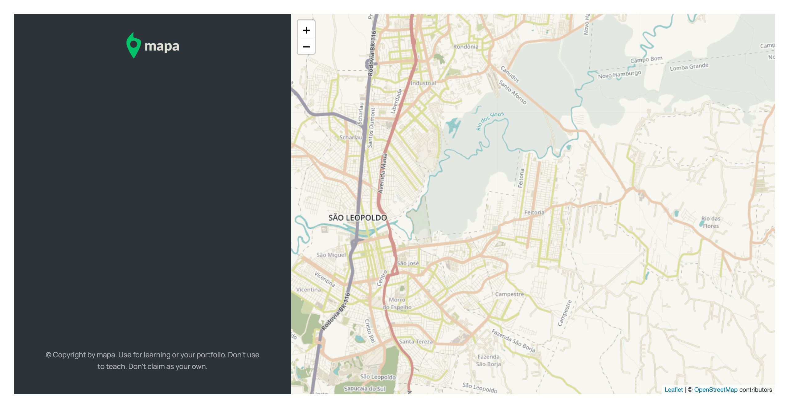

# mapa project

## Habilidades
- OOP (Programação orientada a objetos)
- Geolocalização 
- Planejamento de projeto e mais

## Funcionalidade
Ao clicar em qualquer parte do mapa, você podera marcar um ponto de treino (corrida / ciclismo), introduzindo os dados na area a direita. E ao clicar nos pontos de treinos marcados, o ponto clicado será centralizado.

## Arquitetura 

## Fluxograma

### Pode testa-lo aqui: [mapa-treino](https://mapa-treino.netlify.app/)

Divirta-se :)
### Preview

